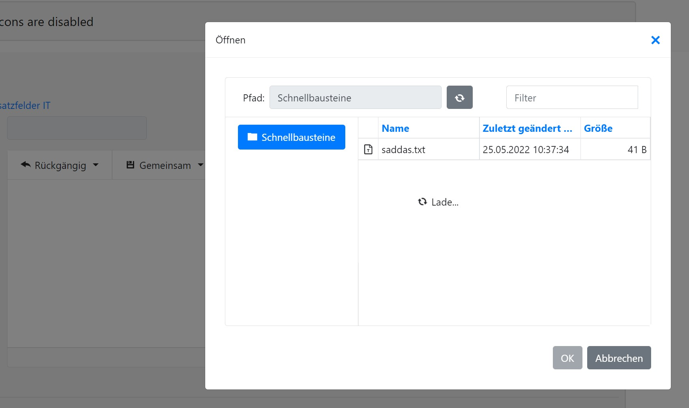

# BootstrapRichEdit FileListSettings

## setting FileListSettings in Load or Init

When setting FileListSettings.View of the BootstrapRichEdit in Page Load or Init you cant load the files.
Loading keeps spinning.

## Solution

Devexpress: change tab visibility only during the first page load or move your code to Page_Init.
